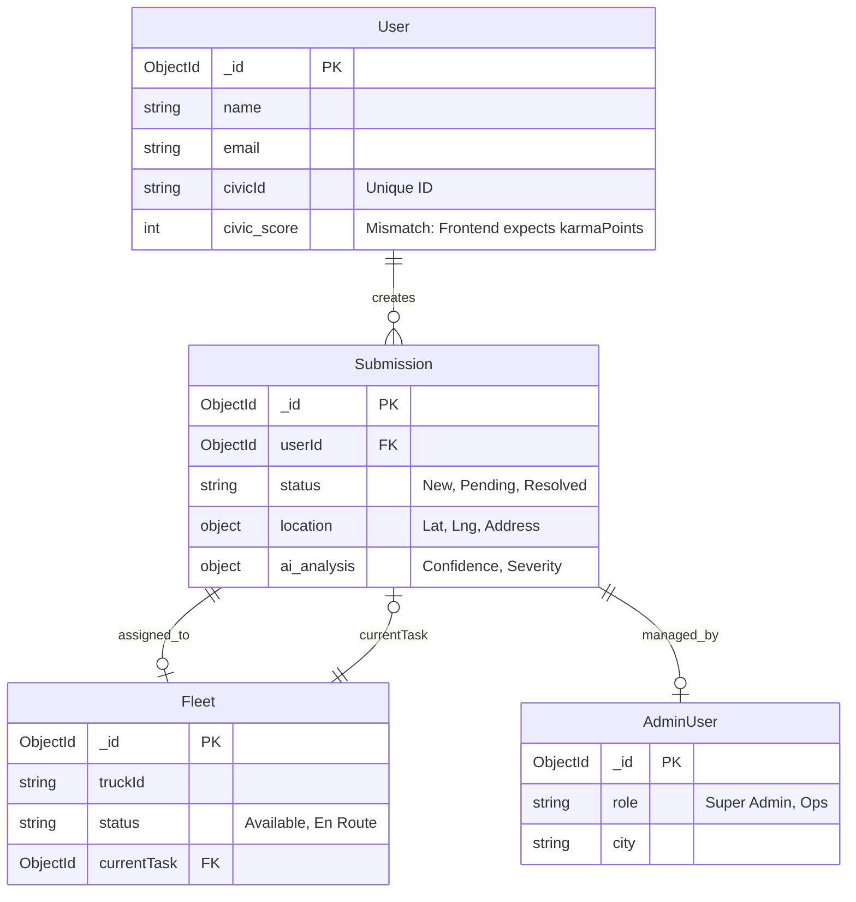

# 🔍 KAVAACH System Audit & Implementation Plan

## 1. 📊 System Architecture & Data Flow

### 1.1 High-Level Data Flow (Frontend ↔ Backend ↔ Database)

This diagram illustrates how data travels from the user's interaction through the API to the database and AI service.

```mermaid
graph TD
    User[End User (Citizen)] -->|Interacts| UI[Frontend (React/Vite)]
    UI -->|HTTP Requests (Axios)| API_GW[API Gateway / Router]
    
    subgraph "Backend Server (Node.js/Express)"
        API_GW -->|Auth Check| AuthMiddleware[Auth Middleware]
        AuthMiddleware -->|Validated Request| Controllers[Controllers]
        Controllers -->|Business Logic| Services[Service Layer]
    end
    
    subgraph "AI Service (FastAPI)"
        Services -->|Forward Image| AI_Engine[YOLOv8 Model]
        AI_Engine -->|Return Analysis| Services
    end
    
    subgraph "Database (MongoDB Atlas)"
        Services -->|Read/Write| DB[(MongoDB)]
    end
    
    Services -->|JSON Response| UI
    UI -->|Update State| StateMgr[Context API]
```

### 1.2 Detailed Request Lifecycle (e.g., Report Submission)

1.  **Frontend**: User uploads image -> Converted to Base64 -> State updated.
2.  **Connection**: `POST /api/submissions` sent with Bearer Token.
3.  **Backend Processing**:
    *   Token validated (User ID extracted).
    *   **CRITICAL ISSUE**: Image stored as Base64 string in DB (inefficient).
    *   **CRITICAL ISSUE**: No verification if `civicId` or `karmaPoints` are updated correctly.
4.  **Database**: New document created in `submissions` collection.
5.  **Response**: 201 Created sent back to UI.

---

## 2. 🗄️ Database Relationships & Schema

The database consists of 4 main collections. The relationships are primarily **One-to-Many**.

### 2.1 Entity Relationship Diagram (ERD)



### 2.2 Critical Data Model Issues
1.  **Field Mismatch**: The `User` model uses `civic_score`, but the Frontend expects `karmaPoints`. This breaks the UI display of user progress.
2.  **Base64 Storage**: Storing full image strings in `Submission.image` causes massive database bloat and slow queries.
3.  **Mock Data Dependency**: The `Leaderboard` page does NOT connect to the `User` database; it uses hardcoded JSON, breaking the "Data Connection".

---

## 3. 🚨 Major Data Transformation & Connection Problems

These are the specific "loopholes" where data fails to transfer correctly between end-points.

### 🔴 1. Data Field Mismatches (The "Lost Data" Problem)
*   **The Issue**: When the frontend requests user data (`/auth/me`), the backend sends `{ civic_score: 100 }`. The frontend code looks for `response.data.karmaPoints`.
*   **Result**: The user sees "0 Points" or undefined, even if they have earned points.
*   **Fix**: Update backend `User` controller to map `civic_score` -> `karmaPoints` in the response JSON.

### 🔴 2. The "Dead End" Profile Edit
*   **The Issue**: The Profile page has a "Save" button for editing personal details.
*   **Analysis**: The `handleSave` function in `Profile.jsx` simply flips a boolean switch (`setIsEditing(false)`). It does **NOT** make an API call.
*   **Result**: Data changes are lost instantly upon refresh.
*   **Fix**: Implement `PUT /api/auth/profile` endpoint and connect it to the frontend.

### 🔴 3. File Metadata Loss during Upload
*   **The Issue**: In `Detect.jsx`, regardless of what file the user uploads (process.png, road.webp), the frontend forces the filename to `'upload.jpg'` when sending to the AI.
*   **Result**: We lose the original file extension and metadata, which might cause processing errors if the format doesn't match the extension.

### 🔴 4. Security: The "Open Door" Policy
*   **The Issue**: The backend allows Cross-Origin Resource Sharing (CORS) from `*` (anywhere).
*   **Result**: Malicious websites can make requests to your API if a user visits them.
*   **The Issue**: Database passwords are currently visible in the `.env` file.

---

## 4. 🛠️ Implementation Plan (Roadmap)

Here is the step-by-step plan to resolve these issues and stabilize the system.

### Phase 1: Critical Fixes (Immediate - "Stop the Bleeding")

1.  **Secure Credentials**:
    *   Rotate MongoDB password immediately.
    *   Generate a secure, random string for `JWT_SECRET`.
    *   Restrict CORS to your specific frontend domain/localhost port.

2.  **Fix Middleware Bug**:
    *   Add `return` statements in `authMiddleware.js` to prevent server crashes when tokens are missing.

3.  **Fix Data Mapping (Karma Points)**:
    *   Modify `auth.js` routes to ensure `karmaPoints` is correctly populated from `civic_score` before sending to frontend.

### Phase 2: Data Integrity & Features (Short Term)

4.  **Connect Leaderboard**:
    *   Create a new backend endpoint `GET /api/users/leaderboard`.
    *   Update `Leaderboard.jsx` to fetch this real data instead of using the `MOCK_LEADERBOARD` constant.

5.  **Enable Profile Updates**:
    *   Create `PUT /api/auth/profile` in backend.
    *   Update `Profile.jsx` to call this API on "Save".

6.  **Optimize Image Storage**:
    *   Stop saving Base64 strings to MongoDB.
    *   Implement logic to save images to a local `uploads/` folder (or S3) and save only the **URL path** in the database.

### Phase 3: Robustness (Long Term)

7.  **Generate Unique Report IDs**:
    *   Replace the current race-condition-prone ID generation with a UUID or atomic counter.
8.  **Automated Cleanup**:
    *   Ensure the AI service deletes temporary images even if analysis fails.

---

## 5. Summary

The application has a solid logical foundation but suffers from "disconnected wires" where the frontend expects data X but the backend provides data Y (or nothing at all). Fixing the **Field Mismatches** and **Missing API Connections** (Profile, Leaderboard) will solve 80% of the visible user-facing bugs.
