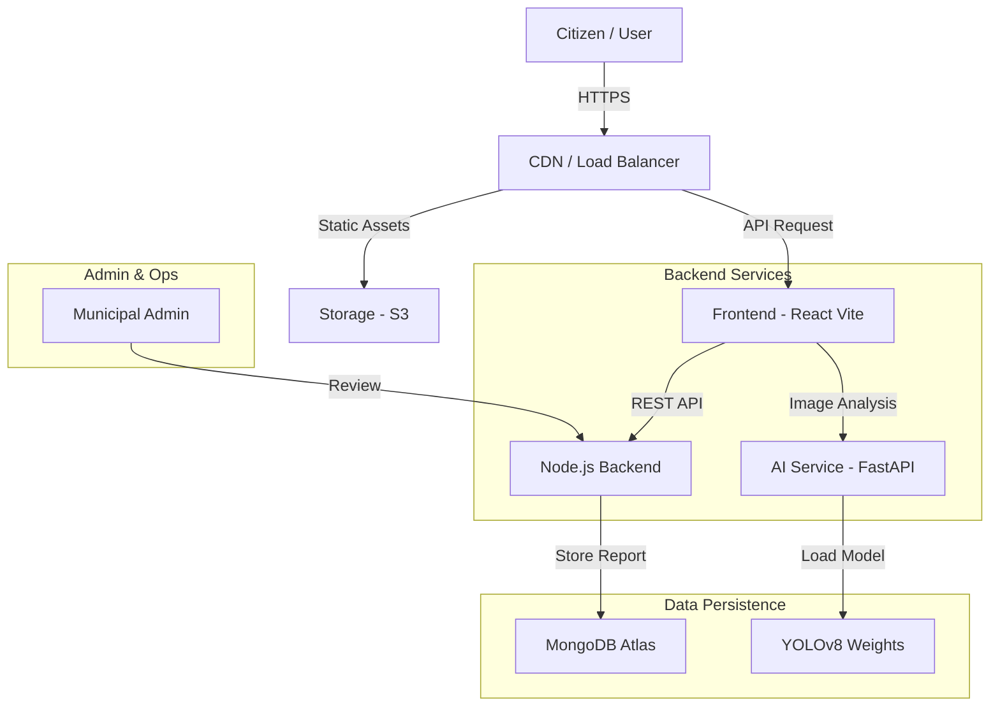
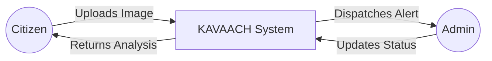
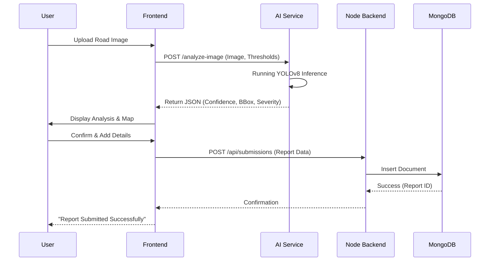

# 🏗️ The Slingshot - System Design Document

## 1. High-Level Architecture

The system follows a modern **Microservices-based Architecture**, separating the User Interface, API Gateway/Business Logic, and AI Inference Engine.

## 2. Data Flow Diagrams (DFD)

### Level 0: Context Diagram

### Level 1: Report Processing Flow

## 3. Database Schema (MongoDB)

Our schema is designed for flexibility and geospatial querying.

### `submissions` Collection
| Field | Type | Description |
|-------|------|-------------|
| `_id` | ObjectId | Unique identifier |
| `reportId` | String | Readable ID (e.g., KVH-2025-001) |
| `image` | String | **URL Path** (local storage) |
| `location` | Object | GeoJSON `{ lat: Number, lng: Number, address: String }` |
| `ai_analysis` | Object | Stores confidence, issue type, severity score |
| `status` | Enum | `['New', 'In Progress', 'Resolved', 'Rejected']` |
| `createdAt` | Date | Timestamp of report |
| `userId` | ObjectId | Reference to User |

### `users` Collection
| Field | Type | Description |
|-------|------|-------------|
| `_id` | ObjectId | Unique identifier |
| `email` | String | Unique email |
| `civic_score`| Number | Gamification score (Karma Points) |
| `role` | Enum | `['citizen', 'admin', 'fleet_manager']` |

## 4. Scalability & Reliability Strategy

### 🚀 Handling Growth
1.  **Image Storage**: Currently using Base64 for rapid prototyping. For production (>10k users), we simply switch the `uploadMiddleware` to stream files to **AWS S3** or **Cloudinary** and store only the URL in MongoDB.
2.  **AI Inference Queue**: Heavy traffic on the detection endpoint can be managed by introducing a message queue (RabbitMQ/Redis). The Frontend uploads the image, gets a Job ID, and polls for status (or uses WebSockets).
3.  **Database Indexing**: geospatial indexes on `location` enable efficient "Find potholes near me" queries as the dataset grows.

### 🛡️ Failure Scenarios
-   **AI Service Down**: The Frontend fails gracefully, allowing "Manual Reporting" where the user selects the issue type manually.
-   **Network Drop**: The PWA (Progressive Web App) strategy allows caching valid reports locally (IndexedDB) and syncing when online.
-   **Bad Data**: Mongoose Validations and Joi schemas at the API layer reject malformed requests before they hit the database.

## 5. Technology Stack
-   **Frontend**: React + Vite (Fast, Responsive)
-   **Backend**: Node.js + Express (Scalable REST API)
-   **AI Engine**: Python + FastAPI + YOLOv8 (High-performance inference)
-   **Database**: MongoDB Atlas (Cloud-native JSON storage)
-   **Maps**: Leaflet / OpenStreetMap (Cost-effective geodata)
